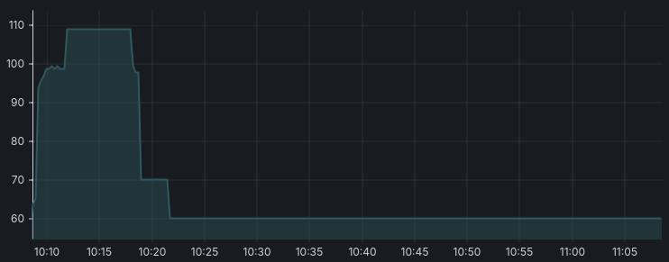

# PromQL Getting Started
Let's start by looking at some of the metrics exposed by the KitHugs services. As mentioned, we have two instances running (both will be scraped by Prometheus). Let's start by looking at the metrics exposed by KitHugs.
You can see the data collected by Prometheus by accessing the following URLs:
* java-app-a: http://localhost:8081/actuator/prometheus
* java-app-b: http://localhost:9081/actuator/prometheus

If you look at the Promethus configuration file you can see that both of these URLs are scraped by Prometheus as a part of the 'java-app' scrape job.

## What Metrics Do We Have and How Do They Look?
The format scraped by Prometheus is documented here: https://prometheus.io/docs/concepts/data_model/

Basically each metric consists of:
* A name: What is measured?
* A number of labels: Unique identification of what is measured in terms of key-value pairs associated with the time series.
  * Instrumentation labels: Labels known within you application (for example: The path of a timed HTTP request)
  * Target labels: Related to architecture and deployment (for example: The id of the Kubernetes worker currently running the service scraped) 
* The actual metric: A number

For example: A metric showing how many bytes are currently allocated in non-heap storage in our KitHugs application.
```
jvm_memory_used_bytes{area="nonheap",id="miscellaneous non-heap storage",} 1.9377264E7
```

There are [different kinds of metrics](https://prometheus.io/docs/concepts/metric_types/).

The example above is a gauge metric. This can be concluded from the metadata in the Prometheus output (see the #TYPE annotation). Notice the instrumentation labels describing the memory area and id.

A gauge metric can increase and decrease.

Key points when defining metrics:
* Use snakecase for metric names and include the unit (at the end)
* Always use 'base units' such as bytes, seconds - you can convert to other units in frontend tools for example Grafana dashboards.
*
*

## How Can We Query Metrics in Prometheus?
After Prometheus scrapes the various targets, the results will be stored in the Prometheus time series database. In order to query the metrics we will use the [Expression browser in the Prometheus UI](http://localhost:9090).

Try and query for jvm_memory_used_bytes.
You should get a result with a number of metrics matching the prometheus endpoint output for the java-app-a and java-app-b. 

```
...
jvm_memory_used_bytes{area="nonheap", id="miscellaneous non-heap storage", instance="java-app-b:8081", job="java-app"} 19377264
...
```

Notice how Prometheus has added target labels for job and instance.

## Aggregation on Labels
As you can see there are individual metrics for heap and nonheap memory as well as the two instances currently scraped. If we instead want to the total memory consumption for "heap" and "nonheap" we can use the sum [aggregation operator](https://prometheus.io/docs/prometheus/latest/querying/operators/#aggregation-operators) with the 'without' clause naming the labels we want to ignore:

Try to evaluate: sum without (instance, id) (jvm_memory_used_bytes)

Alternatively, we can specify the labels to keep:

Try to evaluate: sum by (area, job) (jvm_memory_used_bytes)

Question: What happens if a label (either target or instrumentation labels) is added? How will it affect the output in the two cases above?

Answer: The 'by' removes labels that it does not know about whereas 'without' does not. In that sense 'without' is probably "safer" unless you know exactly what you are looking for (for example in the case of "Info" todo link).


## Info Labels

sum by (job, version) (up * on (instance, job) group_left(version) application_information)

## Increase and rate functions
### Overview

In this section we will take a look at using the increase and rate functions for visualizing counter metrics. We'll do this by taking a look at the prometheus_http_requests_total metric, which for the purpose of this section was set to only visualize the HTTP requests to the /metrics endpoint. 

The most basic way of visualizing data is to simply visualize the counter in a time series:
```
...
prometheus_http_requests_total
...
```


This produces a graph which shows a clear increasing trend in the number of HTTP requests. However, it is difficult from this visualization to assess the rate at which the number of HTTP requests is increasing. Additionally, it is difficult to assess whether the rate at which HTTP requests are being made is constant, increasing or decreasing over time.

There are 2 ways of dealing with this.

### Increase
The first method is the increase function which takes a unit of time as an argument (in this case 20s): 
```
...
increase(prometheus_http_requests_total[20s])
...
```


The increase function in this example is set to a range of 20 seconds. This produces a visualization where every point on the y-axis shows the number of HTTP requests that were produced in the 20 seconds leading up to the time displayed on hovering on the point. 

For example, we see two spikes at the times 10:08:30 and 10:12:00. These spikes hit 20 and 22 on the y-axis respectively. This means that 20 HTTP requests were made between 10:08:10 and 10:08:30, and 22 HTTP requests were made between 10:11:40 and 10:12:00.

It is important to note that the points on the graph overlap in time. For example, we see a point at the timestamp 10:11:45. This point shows us that between 10:11:25 and 10:11:45 2 HTTP requests happened - note that the end time of this interval is after the start time of the next interval. 

### Rate
Now what happens if we replace increase by rate?:
```
...
rate(prometheus_http_requests_total[20s])
...
```


The graph looks exactly the same. The rate and increase functions always produce graphs that look exactly the same. The only change is on the y-axis.

The rate function works the same as the increase function - it just shows the increase per second during the interval of 20 seconds, instead of the total increase during the interval.

When hovering over the spikes, we are now given the values of 1.00 and 1.10 respectively. This means that HTTP requests were occurring at a rate of respectively 1.00 and 1.10 HTTP requests per second during the two spikes.

### Comparison
So when should we use rate, and when should we use increase?

Using rate gives us an estimate of the increase in requests per second. This makes sense when we are visualizing time intervals that are so small that it makes sense to use seconds as a unit. An example of this would be if we wanted only wanted to visualize the HTTP requests that were made in the past 5 minutes.

When we use increase, we can (and should) interpret the points as estimates of the increase per [time unit]. For example, 

```
...
rate(prometheus_http_requests_total[1h])
...
```
gives us an estimate of the hourly increase in HTTP requests. This makes sense for data where we do not care about small rapid changes in data, and are more interested in longer trends.

### Interval length
The longer we choose our intervals to be, the more they will overlap. This makes for prettier graphs that do not display rapid changes but instead make it easier to see long-term trends in data. Here we try setting the interval length to 10 minutes:
```
...
rate(prometheus_http_requests_total[10m])
...
```


There is no objective answer to how long the intervals should be but a good rule of thumb is to make the interval lengths roughly 1/100th of the total width of the graph we're making. Additionally, it is good practice to set the interval length to be either 1 second, 1 minute, 1 hour or 1 day as this is much less likely to lead to misinterpretations of the data. For example, when making a graph visualizing the HTTP requests made over the past 3-7 days, it would make sense to use the increase function and choose the interval lengths to be 1 hour:
```
...
rate(prometheus_http_requests_total[1h])
...
```
### Gauges
We've covered the increase and rate functions, which are used for counters. When dealing with metrics that can both increase and decrease (gauges), one should instead use the delta and deriv functions respectively.