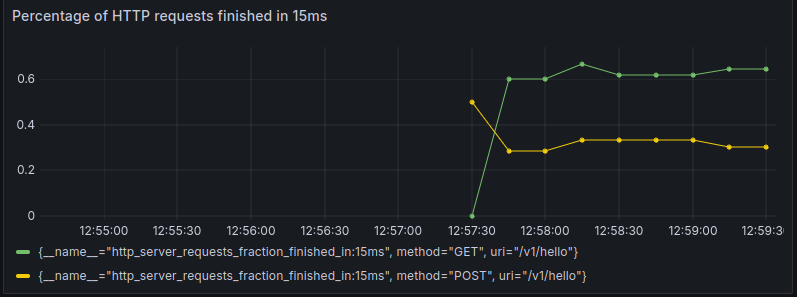

# Configuring Prometheus
Prometheus comes with a bunch of default metrics - in this section we will take a look at how to configure them using recording rules.


## Before we start
Our data goes through the following process:

1) Our applications calculate and expose metrics to an endpoint.
2) Prometheus scrapes these metrics, transforms them and stores them in a database.
3) Grafana reads the metrics, transforms them and visualizes them..

At each of these 3 steps, we can modify our metrics to suit our needs.

Modifying metrics in step 1) requires us to modify the codebase of our applications. This is necessary if we want to define metrics that differ significantly from our default metrics. It is however not worth the effort to make changes to our default metrics at this stage.

Modifying metrics in step 2) is what we will be covering in this chapter.

Modifying metrics in step 3) is what we do when we write promQL queries in Grafana like we did in chapter 3.

The main advantage of choosing to modify metrics in step 2) compared to step 3) is that it makes our modified metrics available in Prometheus (and not just Grafana). This allows us to use the metrics for creating Prometheus alerts. Additionally, it can make it slightly easier to modify and create visualizations in Grafana which rely on complicated promQL queries. 

## Configuring Prometheus
We will be taking a look at the default metric promhttp_metric_handler_requests_total which tells us the total number of http requests to the /metrics endpoint grouped by http code. This metric gives us one value for each individual http code, which can get quite messy:

```
...
promhttp_metric_handler_requests_total{code="500"} 0
promhttp_metric_handler_requests_total{code="501"} 0
promhttp_metric_handler_requests_total{code="502"} 0
promhttp_metric_handler_requests_total{code="503"} 0
...
```

Our goal is to make Prometheus group these into 5 bins to make the metrics less cluttered:

```
promhttp_metric_handler_requests_total:1xx 0
promhttp_metric_handler_requests_total:2xx 0
promhttp_metric_handler_requests_total:3xx 0
promhttp_metric_handler_requests_total:4xx 0
promhttp_metric_handler_requests_total:5xx 0
```

### Grouping HTTP Codes

Firstly, we need to create a ```recording_rules.yml``` file, which will inform Prometheus what metrics to group together and how. In this file we define a group for the default metric we wish to configure and specify each of the new metrics we wish to create:

```
groups:
  - name: http_requests_grouped
    rules:
      #Group all 1xx status codes
      - record: promhttp_metric_handler_requests_total:1xx #name of the new metric
        expr: sum(promhttp_metric_handler_requests_total{code=~"1.."}) by (job) or vector(0) #promQL code for calculating the metric
    
      #Group all 2xx status codes
      - record: promhttp_metric_handler_requests_total:2xx
        expr: sum(promhttp_metric_handler_requests_total{code=~"2.."}) by (job) or vector(0)

      #Group all 3xx status codes
      - record: promhttp_metric_handler_requests_total:3xx
        expr: sum(promhttp_metric_handler_requests_total{code=~"3.."}) by (job) or vector(0)

      #Group all 4xx status codes
      - record: promhttp_metric_handler_requests_total:4xx
        expr: sum(promhttp_metric_handler_requests_total{code=~"4.."}) by (job) or vector(0)

      #Group all 5xx status codes
      - record: promhttp_metric_handler_requests_total:5xx
        expr: sum(promhttp_metric_handler_requests_total{code=~"5.."}) by (job) or vector(0)
```

A new group should be defined for each default metric that we wish to configure.

The ```record``` field specifies the name of a new metric. For example, promhttp_metric_handler_requests_total:1xx is the name for a metric that calculates the total number of HTTP requests with a code starting with "1". The ```expr``` field contains promQL code, which calculates the new metric from the old default metric promhttp_metric_handler_requests_total.

The ```sum(promhttp_metric_handler_requests_total{code=~"1.."}) by (job)``` part of the promQL code calculates the total number of HTTP requests starting with a "1". The ```or vector(0)``` part of the code specifies that if no HTTP requests have been made, Prometheus should return the number 0 instead of "No data".

The second step is to mount the recording_rules.yml file in our docker-compose.yml file:

```
services:
  prometheus:
    volumes:
      - ./prometheus/recording_rules.yml:/opt/bitnami/prometheus/conf/recording_rules.yml
```

I've chosen to mount it to the same folder as my prometheus.yml file, but anywhere is fine.

Additionally, we have to tell Prometheus that our recording_rules.yml file is a rule file. This is done by adding the location of the recording_rules.yml file in our Docker container to the prometheus.yml file:

```
rule_files:
  - /opt/bitnami/prometheus/conf/recording_rules.yml
```

Metrics defined through recording rules update every 60s by default. All other metrics are usually calculated every 15s. Because of this, we want to specify in the prometheus.yml file that our new metrics should be calculated every 15s. We do this by adding ```evaluation interval: 15s``` to the prometheus.yml file in this location:

```
global:
  scrape_interval: 10s
  evaluation_interval: 15s
```

Now our new metrics are available in Prometheus and Grafana. It is however important to note that these new metrics will not show up in the endpoints of our applications.

## Configuring Micrometer to keep track of HTTP requests - Histograms
Sometimes one is interested in monitoring metrics related to HTTP request processing time. In this section we'll take a look at how to implement a metric which tracks two things: 1) the percentage of HTTP requests that finish in less than 15ms and 2) the percentage of HTTP requests that finish in less than 400ms.

In order to achieve this, we will be configuring the default HTTP metrics in Micrometer. This can either be achieved using an application.properties file or by setting environment variables directly in our compose.yaml file. We will be doing the latter because it's easier.

### Making the Number of Fast HTTP Requests a Metric 

We do this simply by setting the management_metrics_distribution_slo_http_server_requests environment variable to *15ms,400ms*. This is done by adding the line ```management_metrics_distribution_slo_http_server_requests=15ms,400ms``` to our compose file:

```
  java-app-a:
    image: kvalitetsit/kithugs:dev
    healthcheck:
       test: "curl --fail http://localhost:8081/actuator/prometheus || exit 1"
       interval: 5s
       timeout: 60s
       start_period: 5s
    networks:
      - monitoring101
    depends_on:
      mariadb:
         condition: service_healthy
    ports:
      - 8081:8081
    environment:
      - management_metrics_distribution_slo_http_server_requests=15ms,400ms 

```

The ```management_metrics_distribution_slo``` part of the env variable is used whenever we want to modify default metrics in Micrometer. The ```http_server_requests``` part tells Micrometer to only modify the metrics related to HTTP server requests.

Once the first HTTP request has been made, the following metrics are generated:

```
#GET
http_server_requests_seconds_bucket{error="none",exception="none",method="GET",outcome="SUCCESS",status="200",uri="/v1/hello",le="0.015"} 5
http_server_requests_seconds_bucket{error="none",exception="none",method="GET",outcome="SUCCESS",status="200",uri="/v1/hello",le="0.4"} 10
http_server_requests_seconds_bucket{error="none",exception="none",method="GET",outcome="SUCCESS",status="200",uri="/v1/hello",le="+Inf"} 10

#POST
http_server_requests_seconds_bucket{error="none",exception="none",method="POST",outcome="SUCCESS",status="200",uri="/v1/hello",le="0.015"} 1
http_server_requests_seconds_bucket{error="none",exception="none",method="POST",outcome="SUCCESS",status="200",uri="/v1/hello",le="0.4"} 6
http_server_requests_seconds_bucket{error="none",exception="none",method="POST",outcome="SUCCESS",status="200",uri="/v1/hello",le="+Inf"} 6
```

The metrics with |```le="+Inf"``` specify the total number of HTTP requests made of the type specified (GET or POST) and is automatically included by Micrometer. The metrics with |```le="0.4"|``` specify the number of HTTP requests that lasted at most 400ms. The metrics with |```le="0.015"|``` specify the number of HTTP requests that lasted at most 15ms. Note that these metrics are cumulative, so all requests included in the ```le="0.015"|``` metric are also included in the ```le="0.4"|``` metric.

### Making the Percentage of Fast HTTP Requests a Metric 
Now how do we create metrics which show the fraction of HTTP requests that are completed in 15ms?

As discussed earlier in this chapter, one approach is to use the metrics we just generated to define custom metrics in our recording_rules.yml file. Another approach is to calculate it in Grafana. We'll do the former by adding these two metrics to our recording_rules.yml file:
```
#Fraction of HTTP requests finished in 15ms or less
- record: http_server_requests_fraction_finished_in:15ms
  expr: (sum(http_server_requests_seconds_bucket{le="0.015"}) by (method, uri)) / (sum(http_server_requests_seconds_bucket{le="+Inf"}) by (method, uri))

#Fraction of HTTP requests finished in 400ms or less
- record: http_server_requests_fraction_finished_in:400ms
  expr: (sum(http_server_requests_seconds_bucket{le="0.4"}) by (method, uri)) / (sum(http_server_requests_seconds_bucket{le="+Inf"}) by (method, uri))
```

The first metric takes the number of HTTP requests finished in 15ms and divides it by the total number of requests, grouped by URI and method. The second metric does the same, but for 400ms instead of 15ms. Method here refers to HTTP methods like POST or GET. URI refers to the URI where the HTTP request happened. 

Once these metrics have been set up, we can easily access them in Prometheus and Grafana, allowing us to make visualizations like the following:



The graph in the screenshot was generating by using the query ```http_server_requests_fraction_finished_in:15ms``` in Grafana.

### An Alternative Approach to Histograms
It should be noted that a similar method exists, which consists of setting the environment variable ´´´management_metrics_distribution_percentiles-histogram_http_server_requests´´´ to ´´´true´´´ *instead* of setting the ´´´management_metrics_distribution_slo_http_server_requests´´´ environment variable. This causes Micrometer to automatically generate a huge amount of metrics similar to ours, but at random interval lengths. I.e. it might make Micrometer count the number of HTTP requests that lasted less than e.g. 137.1231ms or 37.2133ms. This is less useful than the approach we used in this chapter because it gives us significantly less control over the metrics available to us.