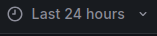
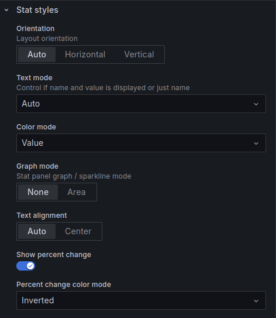

# Keycloak Getting Started
In this section we will be taking a look at how to setup Keycloak and access its metrics.

## Adding Keycloak
We add Keycloak to our docker-compose file in a similar way to the other applications, but with a few key differences:

```
services:
  keycloak:
    image: quay.io/keycloak/keycloak:26.0.5
    command: >
        start --hostname-strict=false --http-port=8080 --http-enabled=true --https-port=-1
    environment:
      - KC_BOOTSTRAP_ADMIN_USERNAME=kit
      - KC_BOOTSTRAP_ADMIN_PASSWORD=Test1234
      - KEYCLOAK_LOGLEVEL=DEBUG
      - DB_VENDOR=h2
      - KC_HEALTH_ENABLED=true #ENABLES HEALTH
      - KC_METRICS_ENABLED=true #ENABLES METRICS
      - KC_HTTP_METRICS_SLOS=50,100,150,200,250,300,350,400,450,500 #CUSTOMIZES METRICS
    networks:
      - monitoring101
    depends_on:
      java-app-a:
         condition: service_healthy
      java-app-b:
         condition: service_healthy
    ports:
      - "8092:8080"
      - "9000:9000" #MAKES METRICS ENDPOINT ACCESSIBLE

```

We use the "start" command along with a few arguments which allow us to quickly start Keycloak without setting up HTTPS. One might be tempted to start Keycloak in development mode using the start-dev command, however the metrics endpoint does not work in development mode. 

In order to enable the metrics endpoint, we have to:

1) Set the KC_HEALTH_ENABLED and KC_METRICS_ENABLED environment variables to true, which enable health and metrics endpoints respectively. We did this in the code block above.

2) Mount port 8080 *and* port 9000. Port 8080 is the default port for most of Keycloak. The /metrics and /health are however by default located on port 9000. We did this in the code block above.

3) Finally, we have to add the following code to our prometheus.yml in order to make prometheus scrape Keycloak's /metrics endpoint:

```
 - job_name: keycloak
   metrics_path: /metrics
   static_configs:
    - targets:
       - keycloak:9000
```

After running docker compose, Keycloak can then be accessed at localhost:8092 and the metrics will be available at localhost:9000/metrics.

## Configuring Keycloak metrics

Keycloak comes with 3 environment variables which can be used to enable additional metrics that are useful for monitoring e.g. login times. These are all set to false by default. The environment variables are:

1) KC_CACHE_METRICS_HISTOGRAMS_ENABLED. If set to true, buckets for various cache related metrics are enabled. These metrics do not appear to very useful. 

2) KC_HTTP_METRICS_HISTOGRAMS_ENABLED. If set to true, buckets for various HTTP related metrics are enabled. These metrics are not very useful, because the buckets are automatically set to completely random values.

3) KC_HTTP_METRICS_SLOS. If we set this environment variable to e.g. ```KC_HTTP_METRICS_SLOS=50,100,200,400```, something rather interesting happens. Similarly to when we set ```management_metrics_distribution_slo``` in chapter 4, custom buckets are generated for a variety of HTTP-related metrics. This is an example of what one of our metrics might look like after logging into Keycloak 20 times:

```
http_server_requests_seconds_bucket{method="POST",outcome="REDIRECTION",status="302",uri="/realms/{realm}/login-actions/authenticate",le="0.05",} 11.0
http_server_requests_seconds_bucket{method="POST",outcome="REDIRECTION",status="302",uri="/realms/{realm}/login-actions/authenticate",le="0.1",} 18.0
http_server_requests_seconds_bucket{method="POST",outcome="REDIRECTION",status="302",uri="/realms/{realm}/login-actions/authenticate",le="0.2",} 19.0
http_server_requests_seconds_bucket{method="POST",outcome="REDIRECTION",status="302",uri="/realms/{realm}/login-actions/authenticate",le="0.4",} 20.0
http_server_requests_seconds_bucket{method="POST",outcome="REDIRECTION",status="302",uri="/realms/{realm}/login-actions/authenticate",le="+Inf",} 20.0
http_server_requests_seconds_count{method="POST",outcome="REDIRECTION",status="302",uri="/realms/{realm}/login-actions/authenticate",} 20.0
http_server_requests_seconds_sum{method="POST",outcome="REDIRECTION",status="302",uri="/realms/{realm}/login-actions/authenticate",} 1.202728308
```

These metrics tell us there were 20 successful login attempts which lasted a total of 1.20 seconds. 11 of the login attempts lasted less than 50ms, 7 of them lasted between 50 and 100ms, 1 of them lasted between 100 and 200ms, and 1 attempt lasted between 200 and 400ms.

Buckets can be customized to be any value in miliseconds, however all HTTP metrics will share the same bucket values. 

Note: https://www.keycloak.org/server/all-config provides a good overview of all Keycloak environment variables, including the ones covered in this chapter.

## What do all of these metrics mean?

One should be very careful when interpreting the meaning of each Keycloak metric. For some reason, Keycloak uses very unintuitive metric names. Here's a brief overview of a few important metrics:

| Metric  | Explanation |
| ------------- | ------------- |
| vendor_statistics_number_of_entries{cache="users",cache_manager="keycloak",}  | Total number of users registered in Keycloak. |
| http_server_requests_seconds_count{method="POST",outcome="SUCCESS",status="200",uri="/realms/{realm}/login-actions/authenticate",}  | The number of failed logins (e.g. due to wrong password or similar)  |
| http_server_requests_seconds_count{method="POST",outcome="REDIRECTION",status="302",uri="/realms/{realm}/login-actions/authenticate",}  | The number of successful logins. |
| http_server_requests_seconds_bucket{method="POST",outcome="REDIRECTION",status="302",uri="/realms/{realm}/login-actions/authenticate",le="*X*"}  | The number of successful logins which lasted less than *X* seconds. |

## Is it possible to customize metrics further?

A lot can be achieved simply by using the previously mentioned environment variable KC_HTTP_METRICS_SLOS and Keycloak's built-in metrics. However, if this proves to be inadequate, one could consider looking into the Keycloak Metrics SPI https://github.com/aerogear/keycloak-metrics-spi. One should however note that a lot of the metrics added by Keycloak Metrics SPI already exist as default metrics in Keycloak, they're just named differently.

## How do we visualize and interpret Keycloak metrics?

Before diving in, one should note that the ```$__range``` variable is a global variable in Grafana which is automatically set to the timeframe our Grafana dashboard is showcasing. For example, if our dashboard is set to show data from the past 24 hours, the ```$__range``` variable will be set to 24h. Using the range variable instead of a hardcoded value like ```[24h]``` in our PromQL queries makes the visualizations adjust their data to match the timeframe selected by the user.

For clarity's sake, the timeframe is selected by pressing this button in Grafana:



### Using Time Series Graphs to visualize Login Times

Let's build a Grafana dashboard using the Keycloak metrics just added to our endpoint. Our first goal is to visualize how quickly login tokens are created. We'll be creating the following visualization using Grafana:


In order to do this, we create a Grafana visualization with 4 separate queries. The first query is:

```
sum(increase(http_server_requests_seconds_bucket{method="POST", outcome="REDIRECTION", uri="/realms/{realm}/login-actions/authenticate",le="0.05"}[$__range])) 
/ 
sum(increase(http_server_requests_seconds_bucket{method="POST", outcome="REDIRECTION", uri="/realms/{realm}/login-actions/authenticate", le="+Inf"}[$__range]))
```

This query first counts the increase in the number of successful login attempts which finished in 0.05 seconds during the timeframe Grafana is set to display. It then divides that number by the total increase in successful login attempts during that same timeframe. This gives us the fraction of login attempts that finished in 0.05 seconds or less.

The 3 other queries do exactly the same, except for 0.10, 0.20 and 0.40 seconds respectively by replacing the ```le="0.05"``` part in the query above:


Finally, we adjust various settings in Grafana to make the visualization prettier and add a description. This won't be covered in detail in this chapter.

### Using Stats to get an Overview of Login Times

Time series graphs like the one we created are nice if one is interested in visualizing the change over the course of a period of time. It is however a good idea to supplement time series visualizations with raw data using "Stat" visualizations in Grafana:


Including this kind of statistics makes it very easy for users to get an overview of the current situation. From this visualization we can clearly see that the average login time is 54.0ms - a tiny increase of 0.1% during the past hour.

In order to implement the Stat, we add a visualization with the following PromQL query to our Grafana dashboard:

```
sum(increase(http_server_requests_seconds_sum{method="POST",outcome="REDIRECTION",status="302",uri="/realms/{realm}/login-actions/authenticate",}[$__range]))
/ 
sum(increase(http_server_requests_seconds_count{method="POST",outcome="REDIRECTION",status="302",uri="/realms/{realm}/login-actions/authenticate",}[$__range]))
```

This query first calculates the total duration it took to process succesful login attempts during the timeframe Grafana is set to display. It then divides that by the total number of successful login attempts in the same timeframe. This gives us the average login time.

In order to customize our stat further, we do 3 additional things in the options section for our "Stat" visualization:

1) We set the unit to seconds. This tells Grafana that the unit our data is stored in is seconds, and simultaneously gives Grafana the permission to convert our data to other units if it so wishes. In our case, Grafana chose to show the data in milliseconds.


2) We set thresholds to 0.1 for yellow and 0.2 for red. This tells Grafana that we want our number to be green if the average login time is less than 0.1 seconds; yellow if it's between 0.1 and 0.2 seconds; and red if above 0.2 seconds.


3) We tick "Show percentage change", which adds a number showing the change in login times (in our case, 0.0998%). By default, this number is green when there's been an increase and red when there's been a decrease in our metric. For our data we want the opposite, since a decrease in login times is good. To achieve this, we select "Inverted" under "Percent change color mode". 



**The percentage shown by "Show percentage change" represents how much something has changed over the time period displayed on the dashboard.** For example, if our timeframe is set to 24 hours, the percentage shown by Grafana represents the change in our metric during those 24 hours.

Final note: As discussed in previous chapters, an alternative approach to creating this kind of visualization is to create custom metrics in our recording_rules.yml file.

### Additional Visualizations of Keycloak Data

The "Keycloak Metrics" dashboard in Grafana contains the visualizations we've created in this chapter in addition to visualizations of several other relevant Keycloak metrics. These metrics include the number of users and the number of failed logins.
